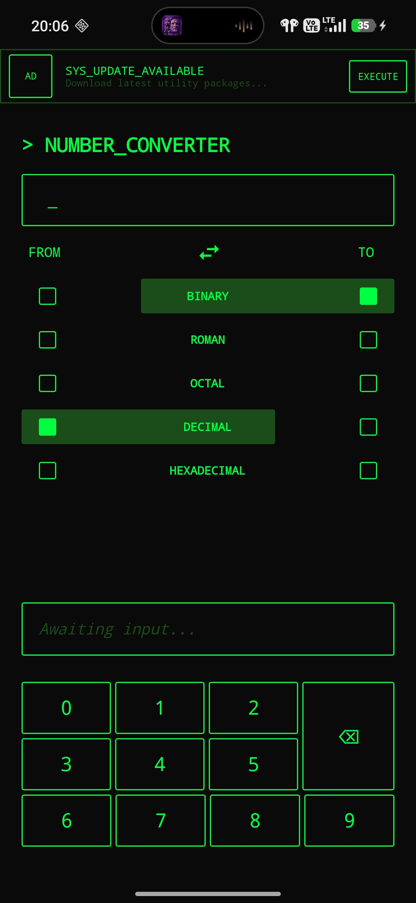

# Retro Terminal Number Converter – Android/Kotlin

A simple, retro-terminal themed Android application that converts numbers between Binary, Roman, Octal, Decimal and Hexadecimal formats. Built entirely with modern Android development standards, this app features custom-built on-screen keyboards tailored to each specific number base, ensuring invalid inputs are impossible.

Built with **Jetpack Compose** and **MVVM**, this project demonstrates a clean, reactive UI seamlessly integrated with robust state management.

## Visuals

  

## Architecture Breakdown

Built using **MVVM (Model-View-ViewModel)** architecture to ensure separation of concerns and state persistence during configuration changes.

The app strictly separates the UI (Jetpack Compose) from the business logic and state management (ViewModel), ensuring scalable, testable, and robust code.

## Tech Stack

*   **Language:** Kotlin
*   **UI:** Jetpack Compose
*   **State:** StateFlow & Compose State
*   **Architecture:** MVVM

## Key Features

*   **Multi-Base Conversion:** Instant, real-time conversion between 5 number types (Binary, Roman, Octal, Decimal, Hexadecimal).
*   **Custom Keyboards:** Dynamic on-screen keyboards that adapt based on the selected "FROM" type (e.g. the Binary keyboard only shows '0' and '1', Hexadecimal includes 1-9 and A-F).
*   **Roman Numeral Engine:** Custom algorithms to accurately calculate and validate Roman numerals up to 3999.
*   **Clipboard Integration:** Long-press the input to paste, or tap the result box to instantly copy the converted data.
*   **Error Handling:** Real-time validation visually flags invalid base conversions (e.g. turning the UI elements red) to guide the user.

## Getting Started

To run this project locally:
1. Clone this repository.
2. Open the project in Android Studio (Jellyfish or newer recommended).
3. Build and run on an emulator or physical device.